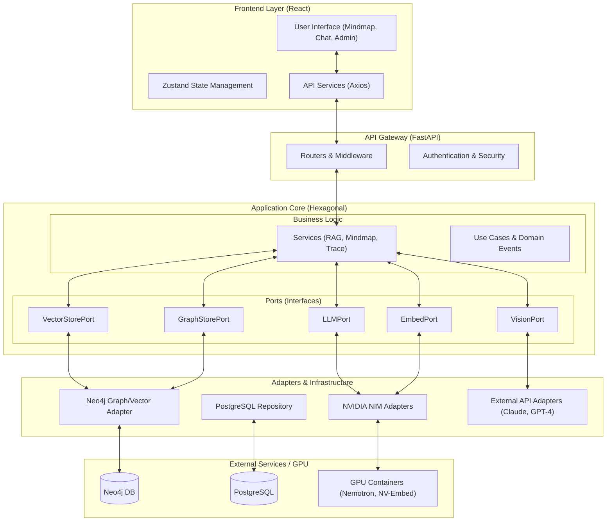
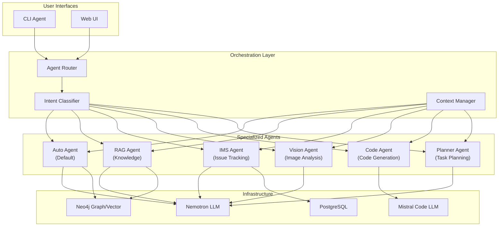

# HybridRAG

A production-ready **Multi-Agent Orchestration Platform** for enterprise knowledge management, featuring specialized AI agents with automatic intent-based routing and hybrid RAG retrieval.

## Overview

HybridRAG is an enterprise-grade AI platform that combines **multi-agent orchestration**, knowledge graph technology, vector embeddings, and LLM capabilities. The system automatically routes queries to specialized agents based on intent classification, enabling sophisticated workflows from document Q&A to issue tracking and code generation.

### Key Differentiators

| Capability | Description |
|------------|-------------|
| **Multi-Agent Orchestration** | 6 specialized agents (Auto, RAG, IMS, Vision, Code, Planner) with automatic intent-based routing |
| **Hybrid RAG** | Combined vector similarity + graph traversal for superior retrieval accuracy |
| **File Context Priority** | Attached files are prioritized over vector search for contextual relevance |
| **Multilingual Native** | First-class support for Japanese, Korean, and English with language-aware prompts |
| **CLI Agent Interface** | Full-featured command-line agent with streaming responses and session management |

**Tech Stack:**
- **RAG LLM**: NVIDIA Nemotron Nano 9B v2 (via NIM Container, GPU 7)
- **Code LLM**: Mistral NeMo 12B (via vLLM, GPU 0)
- **Embeddings**: NVIDIA NV-EmbedQA-Mistral7B-v2 (via NIM Container, GPU 4,5)
- **Database**: Neo4j Graph Database with Vector Index
- **Framework**: LangChain/LangGraph
- **GPU**: NVIDIA A100-SXM4-40GB × 8

## Architecture

Our system follows a **Hexagonal Architecture (Ports & Adapters)** to ensure high maintainability, testability, and decoupling from external technologies. This design allows us to switch LLM providers, database engines, or frontend frameworks with minimal impact on the core business logic.

### Unified System Structure



### 1. Hexagonal Architecture (Ports & Adapters)

The core principle is the isolation of business logic from external factors.

| Layer | Responsibility | Key Components |
|-------|----------------|----------------|
| **Core** | Pure business logic and domain entities | RAG Service, Trace Writer, Domain Events |
| **Ports** | Abstract interfaces defining required services | LLMPort, EmbeddingPort, GraphStorePort |
| **Adapters** | Concrete implementations for specific technologies | LangChainAdapter, Neo4jAdapter, PostgresRepo |
| **Drivers** | Entry points that trigger the business logic | FastAPI Routers, CLI Chat Interface |

### 2. Information Flow

1.  **Request**: The Frontend sends a multilingual query via the FastAPI Gateway.
2.  **Routing**: The Query Router (App Core) classifies the intent (Vector, Graph, Hybrid, or Code).
3.  **Orchestration**: A Composable Chain orchestrates retrieval through the respective Ports.
4.  **Retrieval**: Adapters fetch data from Neo4j (Graph/Vector) or external APIs.
5.  **Generation**: The LLM Adapter (NVIDIA NIM) generates the final response.
6.  **Tracing**: The entire flow is captured by the E2E Trace System for monitoring.

---

## Multi-Agent Orchestration

The core innovation of HybridRAG is its **multi-agent orchestration layer** that routes queries to specialized agents based on intent classification. Each agent is optimized for specific task domains and has access to different toolsets and LLMs.

### Agent Architecture



### Specialized Agents

| Agent | Domain | LLM | Key Capabilities |
|-------|--------|-----|------------------|
| **Auto** | General | Nemotron | Default agent with automatic sub-routing to specialized agents |
| **RAG** | Knowledge Q&A | Nemotron | Hybrid vector/graph retrieval, file context priority, topic density search |
| **IMS** | Issue Management | Nemotron | IMS SSO integration, issue search, crawling, report generation |
| **Vision** | Image Analysis | Claude/GPT-4V | Chart analysis, document OCR, visual Q&A |
| **Code** | Code Generation | Mistral NeMo | Code synthesis, analysis, refactoring, multi-language support |
| **Planner** | Task Planning | Nemotron | Multi-step task decomposition, dependency analysis |

### Intent Classification

The orchestrator uses a **hybrid classification pipeline** combining:

1. **Rule-based Keywords** - Fast pattern matching for explicit agent triggers
2. **Embedding Similarity** - Semantic matching with prototype vectors
3. **LLM Classification** - Fallback for ambiguous queries

```
User Query → Rule Matcher → Embedding Classifier → LLM Classifier → Agent Selection
                  ↓                    ↓                   ↓
              Fast Path           Semantic Path       Fallback Path
              (100%)               (82.9%)            (95%+)
```

### Agent-Specific Tools

Each agent has access to a curated toolset:

| Agent | Available Tools |
|-------|----------------|
| **RAG** | `vector_search`, `graph_traverse`, `document_read`, `topic_density_search` |
| **IMS** | `ims_search`, `ims_crawl`, `ims_report`, `issue_detail` |
| **Vision** | `image_analyze`, `chart_extract`, `document_ocr` |
| **Code** | `code_generate`, `code_analyze`, `code_refactor`, `code_explain` |
| **Planner** | `task_decompose`, `dependency_analyze`, `timeline_generate` |

### File Context Priority

When files are attached via CLI or Web UI, the system prioritizes attached context over vector search:

```
┌─────────────────────────────────────────────────────────────────┐
│ Priority Order for RAG Agent                                    │
├─────────────────────────────────────────────────────────────────┤
│ 1. Attached File Context (highest priority)                    │
│ 2. Error Code Direct Match                                      │
│ 3. Topic Density Search Results                                 │
│ 4. Vector Similarity Results                                    │
│ 5. Graph Traversal Results                                      │
└─────────────────────────────────────────────────────────────────┘
```

This ensures that when users attach specific documents for reference, the LLM responds directly from that context without unnecessary tool calls.

---

### Query Routing Logic

The system uses a **hybrid classification approach** combining rule-based keyword matching with embedding-based semantic similarity for intelligent query routing.

| Query Type | Strategy | Use Case |
|------------|----------|----------|
| **Vector** | Semantic similarity search | Definitions, explanations, methods |
| **Graph** | Entity-based graph traversal | Comparisons, lists, relationships |
| **Hybrid** | Both strategies combined | Error troubleshooting, detailed analysis |
| **Code** | Direct to Code LLM | Code generation, analysis, implementation |

#### Classification Methods

| Method | Accuracy | Speed | Description |
|--------|----------|-------|-------------|
| **Rule-based** | 100% | Fast | Keyword/pattern matching |
| **Embedding** | 82.9% | Medium | Cosine similarity with prototype vectors |
| **Hybrid** | 100% | Medium | Rule + Embedding combined (default) |

#### Multilingual Query Examples

| Language | Vector | Graph | Hybrid | Code |
|----------|--------|-------|--------|------|
| **English** | "What is OpenFrame?" | "Compare A and B" | "How to fix error?" | "Write a Python function" |
| **Korean** | "OpenFrame이란?" | "A와 B의 차이점" | "에러 해결 방법" | "Python 코드 작성해줘" |
| **Japanese** | "OpenFrameとは?" | "AとBの違いは?" | "エラーの対処方法" | "Pythonコードを書いて" |

#### Error Code Detection

Queries containing error codes are automatically detected and routed:

| Pattern | Example | Routing |
|---------|---------|---------|
| Uppercase with ERR/ERROR | `NVSM_ERR_SYSTEM_FWRITE` | HYBRID/GRAPH |
| Standard format | `OFM-1234` | HYBRID/GRAPH |
| **Numeric codes** | `-5212`, `-5211` | **HYBRID (direct search)** |

- **Error code + troubleshooting keywords** → HYBRID (semantic + entity search)
- **Error code only** → GRAPH (entity lookup)
- **Numeric error codes** → HYBRID with direct content search (highest priority)

**Numeric Error Code Example:**
```
Query: -5212에러코드의 의미와 해결방법

Strategy: [HYBRID/Combined]
Sources: 10

DSALC_ERR_DATASET_NOT_FOUND (-5212) 에러는 기존의 데이터세트가
찾히지 않는 경우에 발생합니다.

해결방법: 데이터세트를 생성한 후 다시 실행
```

#### Code Query Detection

Queries requesting code generation or analysis are automatically routed to the Code LLM (Mistral NeMo 12B):

| Language | Detection Keywords |
|----------|-------------------|
| **English** | `write code`, `sample code`, `implement`, `python function` |
| **Korean** | `코드 작성`, `샘플 코드`, `구현`, `코드 분석` |
| **Japanese** | `コードを書`, `関数を書`, `サンプルコード`, `実装` |

**Example:**
```
You: Python으로 피보나치 함수를 작성해줘

Strategy: [CODE/Mistral-NeMo]
Language: ko | Sources: 0 | Time: 2.15s

def fibonacci(n):
    if n <= 1:
        return n
    return fibonacci(n-1) + fibonacci(n-2)
```

## Project Structure

```
gpubase-raphrag/
│
├── cli/                                    # CLI Agent Interface
│   ├── main.py                             # CLI entry point
│   ├── agent.py                            # Agent client with file attachment
│   ├── ui.py                               # Terminal UI with Rich formatting
│   ├── i18n.py                             # Multilingual messages (ko/en/ja)
│   └── commands.py                         # Command handlers
│
├── app/                                    # Backend Application
│   ├── requirements.txt
│   ├── docs/                               # PDF documents (JP/KR/EN)
│   ├── src/                                # Legacy RAG implementation
│   │   ├── config.py                       # Configuration management
│   │   ├── embeddings.py                   # NeMo Embedding service
│   │   ├── query_router.py                 # Query classification
│   │   ├── hybrid_rag.py                   # Hybrid RAG orchestrator
│   │   ├── graphrag.py                     # Core HybridRAG class
│   │   └── chat_rag.py                     # Interactive chat interface
│   │
│   └── api/                                # FastAPI Backend (Main)
│       ├── main.py                         # App entry, middleware, router registration
│       ├── run.py                          # Server runner
│       │
│       ├── core/                           # Framework infrastructure
│       │   ├── config.py                   # API settings from environment
│       │   ├── deps.py                     # Main DI container (94KB)
│       │   ├── app_mode.py                 # Develop/Product mode
│       │   ├── secrets_manager.py          # Secrets validation
│       │   ├── security_middleware.py      # CSP, CORS, security headers
│       │   ├── cookie_auth.py              # HttpOnly cookie management
│       │   ├── logging_framework.py        # Advanced logging
│       │   ├── circuit_breaker.py          # Fault tolerance
│       │   └── exceptions.py               # Custom exceptions
│       │
│       ├── routers/                        # API endpoints (27 files)
│       │   ├── auth.py                     # Authentication
│       │   ├── query.py                    # RAG query execution
│       │   ├── documents.py                # Document management
│       │   ├── conversations.py            # Multi-turn conversations
│       │   ├── mindmap.py                  # Mind map generation
│       │   ├── vision.py                   # Vision LLM queries
│       │   ├── knowledge_graph.py          # Knowledge graph
│       │   ├── knowledge_article.py        # Knowledge workflow
│       │   ├── content.py                  # AI content generation
│       │   ├── external_connection.py      # External connectors
│       │   ├── admin.py                    # Admin dashboard
│       │   ├── enterprise.py               # Enterprise features
│       │   └── workspace.py                # Workspace state
│       │
│       ├── services/                       # Business logic (30+ files)
│       │   ├── rag_service.py              # Core RAG integration
│       │   ├── auth_service.py             # Authentication
│       │   ├── conversation_service.py     # Conversation management
│       │   ├── document_parser.py          # Document parsing
│       │   ├── mindmap_service.py          # Mind map generation
│       │   ├── knowledge_graph_service.py  # Knowledge graph
│       │   ├── vision_router.py            # Vision LLM routing
│       │   ├── vision_rag_integration.py   # Vision + RAG
│       │   ├── vlm_service.py              # Vision LLM service
│       │   └── external_document_service.py # External resources
│       │
│       ├── models/                         # Pydantic schemas (25+ files)
│       │   ├── auth.py                     # Auth models
│       │   ├── query.py                    # Query models
│       │   ├── conversation.py             # Conversation models
│       │   ├── document.py                 # Document models
│       │   └── vision.py                   # Vision models
│       │
│       ├── adapters/                       # External service adapters
│       │   ├── langchain/                  # LangChain adapters
│       │   │   ├── llm_adapter.py          # ChatOpenAI wrapper
│       │   │   └── embedding_adapter.py    # Embedding wrapper
│       │   ├── mock/                       # Mock for testing
│       │   └── vision/                     # Vision LLM adapters
│       │       ├── anthropic_vision_adapter.py
│       │       └── openai_vision_adapter.py
│       │
│       ├── ports/                          # Hexagonal architecture interfaces
│       │   ├── llm_port.py
│       │   ├── embedding_port.py
│       │   ├── vector_store_port.py
│       │   ├── graph_store_port.py
│       │   └── vision_llm_port.py
│       │
│       ├── chains/                         # RAG chain implementations
│       │   ├── retrieval_chain.py
│       │   ├── generation_chain.py
│       │   └── rag_chain.py
│       │
│       ├── pipeline/                       # Vision LLM orchestration
│       │   ├── orchestrator.py
│       │   └── vision_orchestrator.py
│       │
│       ├── connectors/                     # External connectors
│       │   ├── confluence_connector.py
│       │   ├── github_connector.py
│       │   ├── google_drive_connector.py
│       │   ├── notion_connector.py
│       │   └── onenote_connector.py
│       │
│       ├── repositories/                   # Data access layer
│       │   ├── conversation_repository.py
│       │   ├── document_repository.py
│       │   └── user_repository.py
│       │
│       ├── infrastructure/                 # Infrastructure implementations
│       │   ├── memory/                     # In-memory (testing)
│       │   ├── postgres/                   # PostgreSQL (production)
│       │   └── services/
│       │       └── trace_writer.py         # E2E message tracing
│       │
│       └── ims_crawler/                    # IMS Crawler (DDD architecture)
│           ├── application/                # Use cases
│           ├── domain/                     # Entities, models, ports
│           ├── infrastructure/             # Adapters, services
│           └── presentation/               # Routers
│
├── frontend/                               # React Frontend Application
│   ├── src/
│   │   ├── main.tsx                        # React app entry point
│   │   ├── App.tsx                         # Root component (routing, auth guards)
│   │   │
│   │   ├── pages/                          # Page components
│   │   │   ├── LoginPage.tsx               # Authentication UI
│   │   │   ├── MainDashboard.tsx           # Main dashboard
│   │   │   ├── KnowledgeApp.tsx            # RAG chat interface
│   │   │   ├── MindmapApp.tsx              # Mindmap visualization
│   │   │   ├── AdminDashboard.tsx          # Admin interface
│   │   │   └── SSOCallbackPage.tsx         # SSO callback handler
│   │   │
│   │   ├── components/                     # Shared UI components
│   │   │   ├── MindmapViewer.tsx           # React Flow visualization
│   │   │   ├── MindmapNode.tsx             # Custom node component
│   │   │   ├── NodePanel.tsx               # Node detail/query panel
│   │   │   ├── Sidebar.tsx                 # Navigation sidebar
│   │   │   ├── LanguageSelector.tsx        # Multi-language dropdown
│   │   │   └── ThemeToggle.tsx             # Dark/light/system theme
│   │   │
│   │   ├── features/                       # Feature modules
│   │   │   ├── knowledge/                  # Knowledge RAG feature
│   │   │   │   ├── components/             # ChatTab, DocumentsTab, etc.
│   │   │   │   ├── hooks/                  # useConversationHistory
│   │   │   │   ├── services/               # knowledge-api.ts
│   │   │   │   └── types/
│   │   │   │
│   │   │   └── ims/                        # IMS Crawler feature
│   │   │       ├── components/             # IMSDashboard, IMSSearchBar
│   │   │       ├── hooks/                  # useSSEStream
│   │   │       ├── services/               # ims-api.ts
│   │   │       └── store/                  # imsStore.ts
│   │   │
│   │   ├── store/                          # Zustand state management
│   │   │   ├── authStore.ts                # Authentication state
│   │   │   ├── preferencesStore.ts         # Theme & language
│   │   │   └── workspaceStore.ts           # Workspace state
│   │   │
│   │   ├── services/
│   │   │   └── api.ts                      # Mindmap API client
│   │   │
│   │   ├── hooks/                          # Custom React hooks
│   │   │   ├── useTranslation.ts           # i18n hook
│   │   │   ├── useTheme.ts                 # Theme management
│   │   │   ├── useLanguagePolicy.ts        # Language restrictions
│   │   │   └── useLocaleFormat.ts          # Locale formatting
│   │   │
│   │   ├── i18n/                           # Internationalization
│   │   │   ├── I18nContext.tsx             # React Context
│   │   │   ├── index.ts                    # Translation logic
│   │   │   └── locales/                    # Translation files
│   │   │       ├── en/                     # English (9 namespaces)
│   │   │       ├── ko/                     # Korean (9 namespaces)
│   │   │       └── ja/                     # Japanese (9 namespaces)
│   │   │
│   │   ├── types/
│   │   │   └── mindmap.ts                  # TypeScript types
│   │   │
│   │   └── __tests__/                      # Tests
│   │       └── e2e/                        # Playwright E2E tests
│   │
│   ├── package.json
│   ├── vite.config.ts                      # Vite build configuration
│   ├── tsconfig.json                       # TypeScript configuration
│   └── playwright.config.ts                # E2E test configuration
│
├── docker/                                 # Container orchestration
│   ├── docker-compose.yml                  # Service definitions
│   ├── start-services.sh                   # Start script
│   ├── stop-services.sh                    # Stop script
│   └── status-services.sh                  # Health check script
│
├── tests/                                  # Backend tests
│   ├── api/                                # API endpoint tests
│   ├── integration/                        # Integration tests
│   └── mocks/                              # Mock services
│
├── migrations/                             # Database migrations
├── scripts/                                # Utility scripts
├── docs/                                   # Documentation
│
├── requirements-api.txt                    # Backend dependencies
├── .env.example                            # Environment template
├── CLAUDE.md                               # Claude Code guidance
├── README.md                               # This file
│
└── neo4j/                                  # Neo4j data directory
```

## Installation

```bash
pip install -r app/requirements.txt
```

## Quick Start

### 1. Start Services (Docker)

```bash
cd docker

# Start all services (with health check)
./start-services.sh

# Check service status
./status-services.sh

# Stop services (data preserved)
./stop-services.sh
```

**Service Management Scripts:**

| Script | Description |
|--------|-------------|
| `start-services.sh` | Start all containers with health monitoring |
| `stop-services.sh` | Graceful shutdown (data persisted) |
| `status-services.sh` | Check health, GPU usage, disk usage |

**Data Persistence:**

All data is stored in bind-mounted directories and persists across container restarts:

| Service | Data Location | Description |
|---------|---------------|-------------|
| Neo4j | `neo4j/data/` | Graph database |
| Nemotron LLM | `data/nim_llm_cache/` | Model cache |
| NeMo Embedding | `data/nim_embed_cache/` | Embedding cache |
| Mistral Coder | `data/huggingface_cache/` | HuggingFace models |

**Status Check Example:**
```
$ ./status-services.sh

Container Status:
------------------------------------------------------------
NAMES                         STATUS              PORTS
neo4j-graphrag                Up 10 hours         7474, 7687
nemotron-graphrag             Up 10 hours         12800
docker-nemo-embedding-1       Up 5 hours          12801
docker-mistral-nemo-coder-1   Up 2 hours          12802

Health Check:
------------------------------------------------------------
  Neo4j               : OK
  Nemotron LLM        : OK
  NeMo Embedding      : OK
  Mistral Coder       : OK

GPU Usage:
------------------------------------------------------------
  GPU 0:  37485/40960 MB - Mistral Coder
  GPU 4:  35865/40960 MB - NeMo Embedding
  GPU 5:  35865/40960 MB - NeMo Embedding
  GPU 7:  36681/40960 MB - Nemotron LLM
```

### 2. CLI Agent Interface

The CLI provides a full-featured agent interface with streaming responses, file attachment, and multi-agent routing.

```bash
# Start CLI Agent
cd cli
python main.py

# With language setting
python main.py --language ja
```

**Core Commands:**

| Command | Description |
|---------|-------------|
| `/help` | Show all available commands |
| `/agent [type]` | Switch agent (auto, rag, ims, vision, code, planner) |
| `/status` | Show current session status |
| `/new` | Start new conversation |
| `/quit` | Exit CLI |

**File Attachment Commands:**

| Command | Description |
|---------|-------------|
| `/attach <path>` | Attach file for RAG context priority |
| `/files` | List currently attached files |
| `/detach [filename]` | Remove attached file (all if no filename) |

**IMS Agent Commands:**

| Command | Description |
|---------|-------------|
| `/ims-login` | Login to IMS with SSO credentials |
| `/ims-logout` | Logout from IMS |
| `/ims-status` | Check IMS connection status |

**Example Session:**

```
$ python main.py

KMS RAG Agent v2.0 - Multi-Agent System
Available agents: auto, rag, ims, vision, code, planner
━━━━━━━━━━━━━━━━━━━━━━━━━━━━━━━━━━━━━━━━━━━━━━━━━━━━━━━

You: /attach ./docs/tibero_manual.pdf
📎 File attached: tibero_manual.pdf (2.3 MB)

You: Tiberoの最大セッション数は?
📎 Using 1 attached file(s): tibero_manual.pdf

[RAG/Attached Context]
添付されたドキュメントによると、Tiberoの最大セッション数は65,535です。

You: /agent code

Agent switched: code (Mistral NeMo 12B)

You: Write a Python connection pool for Tibero

[CODE/Mistral-NeMo]
```python
import cx_Oracle
from contextlib import contextmanager

class TiberoPool:
    def __init__(self, user, password, dsn, min=5, max=20):
        self.pool = cx_Oracle.SessionPool(
            user=user, password=password, dsn=dsn,
            min=min, max=max, increment=1
        )

    @contextmanager
    def connection(self):
        conn = self.pool.acquire()
        try:
            yield conn
        finally:
            self.pool.release(conn)
```

You: /detach
All files detached.
```

**Multilingual Support:**

The CLI supports Korean (ko), English (en), and Japanese (ja) with localized messages:

| Message Key | Korean | English | Japanese |
|-------------|--------|---------|----------|
| `session_restored` | 세션이 복원되었습니다 | Session restored | セッションが復元されました |
| `agent_switched` | 에이전트 전환됨 | Agent switched | エージェント切替 |
| `formatting_output` | 출력데이터 포맷중입니다... | Formatting output data... | 出力データをフォーマット中... |

---

### 3. Legacy Interactive Chat

```bash
cd app/src
python chat_rag.py
```

**Chat Commands:**
- `/help` - Show help
- `/stats` - Show database statistics
- `/history` - Show chat history
- `/context` - Toggle conversation context mode
- `/clear` - Clear history
- `/quit` - Exit

**Example Session:**
```
You: NVSM_ERR_SYSTEM_FWRITE 에러의 조치방법에 대해서 알려주세요

Strategy: [HYBRID/Combined]
Language: ko | Sources: 5 | Time: 3.66s

NVSM_ERR_SYSTEM_FWRITE(-922) 에러가 발생한 경우, 스풀에 출력된
시스템 함수 호출 관련 에러 메시지를 확인하여 구체적인 원인을
파악해야 합니다.
```

### 3. Run Programmatic RAG

```bash
# Basic HybridRAG (Graph only)
python app/src/graphrag.py

# Hybrid RAG (Vector + Graph)
python app/src/hybrid_rag.py
```

### 4. Test PDF Processing

```bash
python app/src/pdf_rag_test.py
```

## Configuration

Environment variables (docker/.env):

| Variable | Description | Default |
|----------|-------------|---------|
| LLM_API_URL | Nemotron NIM endpoint | http://localhost:12800/v1/chat/completions |
| LLM_MODEL | LLM model name | nvidia/nvidia-nemotron-nano-9b-v2 |
| CODE_LLM_API_URL | Mistral NeMo endpoint | http://localhost:12802/v1/chat/completions |
| CODE_LLM_MODEL | Code LLM model name | mistralai/Mistral-Nemo-Instruct-2407 |
| EMBEDDING_API_URL | Embedding NIM endpoint | http://localhost:12801/v1 |
| EMBEDDING_MODEL | Embedding model name | nvidia/nv-embedqa-mistral-7b-v2 |
| NEO4J_URI | Neo4j Bolt connection | bolt://localhost:7687 |
| NEO4J_USER | Neo4j username | neo4j |
| NEO4J_PASSWORD | Neo4j password | - |
| NGC_API_KEY | NVIDIA NGC API key | - |

## Port Allocations

| Port | Service |
|------|---------|
| 12800 | Nemotron NIM LLM API (GPU 7) |
| 12801 | NeMo Embedding NIM API (GPU 4,5) |
| 12802 | Mistral NeMo Code LLM (GPU 0) |
| 8000 | FastAPI Backend |
| 3000 | React Frontend (Mindmap UI) |
| 7474 | Neo4j HTTP |
| 7687 | Neo4j Bolt |

## GPU Memory Requirements

### Nemotron Nano 9B on A100-40GB

Nemotron Nano 9B requires special configuration to run on A100-40GB GPUs due to high memory requirements:

| Component | Memory |
|-----------|--------|
| Model Weights | ~17 GiB |
| Mamba Cache (default) | ~34 GiB |
| **Total (default)** | **~51 GiB** ❌ |

**Problem:** Default settings require ~51 GiB, exceeding A100-40GB capacity.

**Solution:** Add memory optimization settings in `docker-compose.yml`:

```yaml
environment:
  - NIM_MAX_NUM_SEQS=64      # Limit max sequences (default: 256)
  - NIM_MAX_MODEL_LEN=8192   # Limit context length (default: 131072)
```

| Setting | Default | Optimized | Effect |
|---------|---------|-----------|--------|
| `NIM_MAX_NUM_SEQS` | 256 | **64** | Reduces Mamba cache size |
| `NIM_MAX_MODEL_LEN` | 131072 | **8192** | Reduces KV cache allocation |

**Result with optimized settings:**

| Component | Memory |
|-----------|--------|
| Model Weights | ~17 GiB |
| Mamba Cache (optimized) | ~18 GiB |
| **Total (optimized)** | **~35 GiB** ✅ |

### GPU Allocation Summary

| Service | GPU | Memory Used | Memory Limit |
|---------|-----|-------------|--------------|
| Nemotron LLM | GPU 7 | ~35 GiB | 40 GiB |
| Mistral Coder | GPU 0 | ~37 GiB | 40 GiB |
| NeMo Embedding | GPU 4,5 | ~36 GiB × 2 | 40 GiB × 2 |

### GPU Isolation

GPU isolation is configured via environment variables (not Docker deploy section):

```yaml
environment:
  - NVIDIA_VISIBLE_DEVICES=7    # Physical GPU to use
  - CUDA_VISIBLE_DEVICES=0      # Logical GPU inside container
```

**Note:** The container sees only the specified GPU(s), mapped to logical device 0 internally.

## Backend Architecture

### Tech Stack

| Category | Technology | Version |
|----------|------------|---------|
| **Framework** | FastAPI | 0.104+ |
| **Language** | Python | 3.10+ |
| **Async Runtime** | Uvicorn | Latest |
| **Data Validation** | Pydantic | 2.5+ |
| **Database** | PostgreSQL (asyncpg) | 14+ |
| **Graph Database** | Neo4j | 5.14+ |
| **LLM Framework** | LangChain, LangGraph | 0.1+ |
| **HTTP Client** | aiohttp, httpx | 3.9+, 0.25+ |
| **Authentication** | PyJWT, bcrypt | Latest |
| **Encryption** | PyCryptodomex | Latest |
| **Document Processing** | PyPDF2, python-docx | Latest |
| **Web Scraping** | Playwright, BeautifulSoup, trafilatura | 1.40+ |

### Directory Structure

```
app/api/
├── main.py                      # FastAPI app entry, middleware, router registration
├── run.py                       # Server runner script
│
├── core/                        # Framework infrastructure (22 files)
│   ├── config.py                # API settings from environment
│   ├── deps.py                  # Main DI container (94KB)
│   ├── app_mode.py              # Develop/Product mode configuration
│   ├── secrets_manager.py       # Secrets validation at startup
│   ├── security_middleware.py   # CSP, CORS, security headers
│   ├── cookie_auth.py           # HttpOnly cookie management
│   ├── logging_framework.py     # Advanced logging with categories
│   ├── circuit_breaker.py       # Fault tolerance
│   ├── trace_context.py         # Distributed tracing
│   └── exceptions.py            # Custom exceptions
│
├── routers/                     # API endpoint definitions (27 files)
│   ├── auth.py                  # Authentication (login, refresh, logout)
│   ├── query.py                 # RAG query execution
│   ├── documents.py             # Document upload and management
│   ├── conversations.py         # Multi-turn conversation management
│   ├── mindmap.py               # Mind map generation
│   ├── vision.py                # Vision LLM queries
│   ├── knowledge_graph.py       # Knowledge graph generation
│   ├── knowledge_article.py     # Knowledge article workflow
│   ├── content.py               # AI content generation
│   ├── external_connection.py   # External connectors (GitHub, Notion, etc.)
│   ├── admin.py                 # Admin dashboard
│   ├── enterprise.py            # Enterprise features (MFA, audit)
│   ├── workspace.py             # Persistent workspace state
│   └── ...                      # 14 more routers
│
├── services/                    # Business logic layer (30+ files)
│   ├── rag_service.py           # Core RAG integration
│   ├── auth_service.py          # PostgreSQL-backed authentication
│   ├── conversation_service.py  # Conversation management
│   ├── document_parser.py       # Document parsing
│   ├── mindmap_service.py       # Mind map generation
│   ├── knowledge_graph_service.py # Knowledge graph generation
│   ├── vision_router.py         # Vision LLM routing
│   ├── vision_rag_integration.py # Vision + RAG integration
│   ├── vlm_service.py           # Vision language model service
│   ├── external_document_service.py # External resource indexing
│   └── ...                      # 20+ more services
│
├── models/                      # Pydantic schemas (25+ files)
│   ├── auth.py                  # Authentication models
│   ├── query.py                 # Query models with strategy types
│   ├── conversation.py          # Conversation models
│   ├── document.py              # Document models
│   ├── vision.py                # Vision LLM models
│   └── ...                      # 20+ more models
│
├── adapters/                    # External service adapters
│   ├── langchain/               # LangChain adapters
│   │   ├── llm_adapter.py       # ChatOpenAI wrapper
│   │   └── embedding_adapter.py # Embedding wrapper
│   ├── mock/                    # Mock implementations for testing
│   │   ├── llm_adapter.py
│   │   ├── embedding_adapter.py
│   │   ├── vector_store_adapter.py
│   │   └── graph_store_adapter.py
│   └── vision/                  # Vision LLM adapters
│       ├── anthropic_vision_adapter.py  # Claude Vision
│       └── openai_vision_adapter.py     # GPT-4V
│
├── ports/                       # Hexagonal architecture interfaces
│   ├── llm_port.py              # LLM interface
│   ├── embedding_port.py        # Embedding interface
│   ├── vector_store_port.py     # Vector store interface
│   ├── graph_store_port.py      # Graph store interface
│   └── vision_llm_port.py       # Vision LLM interface
│
├── agents/                      # Multi-Agent System
│   ├── orchestrator.py          # Agent routing and orchestration
│   ├── executor.py              # Agent execution with tool calling
│   └── agents/                  # Specialized agents
│       ├── auto_agent.py        # Default auto-routing agent
│       ├── rag_agent.py         # Knowledge RAG agent
│       ├── ims_agent.py         # IMS integration agent
│       ├── vision_agent.py      # Vision analysis agent
│       ├── code_agent.py        # Code generation agent
│       └── planner_agent.py     # Task planning agent
│
├── chains/                      # Composable RAG chains
│   ├── base.py                  # Base chain infrastructure
│   ├── retrieval_chain.py       # Retrieval stage
│   ├── generation_chain.py      # Generation stage
│   └── rag_chain.py             # Complete RAG chain
│
├── pipeline/                    # Vision LLM orchestration
│   ├── orchestrator.py          # Main pipeline orchestrator
│   ├── vision_orchestrator.py   # Vision-specific orchestration
│   ├── embedding.py             # Embedding stage
│   ├── retrieval.py             # Retrieval stage
│   └── generation.py            # Generation stage
│
├── connectors/                  # External resource connectors
│   ├── base.py                  # Base connector interface
│   ├── confluence_connector.py  # Confluence sync
│   ├── github_connector.py      # GitHub sync
│   ├── google_drive_connector.py # Google Drive sync
│   ├── notion_connector.py      # Notion sync
│   ├── onenote_connector.py     # OneNote sync
│   └── resilient_connector.py   # Fault-tolerant wrapper
│
├── repositories/                # Data access layer
│   ├── base.py                  # Generic CRUD interface
│   ├── conversation_repository.py
│   ├── document_repository.py
│   ├── user_repository.py
│   └── ...
│
├── infrastructure/              # Infrastructure implementations
│   ├── memory/                  # In-memory (testing)
│   ├── postgres/                # PostgreSQL (production)
│   │   ├── conversation_repository.py
│   │   ├── user_repository.py
│   │   └── trace_repository.py
│   └── services/
│       └── trace_writer.py      # E2E message tracing
│
├── events/                      # Event-driven architecture
│   ├── domain_events.py         # Domain event definitions
│   ├── event_bus.py             # In-memory event bus
│   └── handlers.py              # Event handlers
│
├── prompts/                     # LLM prompt templates
│   ├── rag_prompts.py           # RAG-specific prompts
│   ├── system_prompts.py        # System role prompts
│   └── mindmap_prompts.py       # Mind map prompts
│
├── usecases/                    # Use case implementations
│   ├── query.py                 # Query use cases
│   ├── document.py              # Document use cases
│   └── mindmap.py               # Mind map use cases
│
├── middleware/                  # Custom middleware
│   └── vision_rate_limiter.py   # Vision API rate limiting
│
└── ims_crawler/                 # IMS Issue crawler system (DDD)
    ├── application/             # Application layer (use cases)
    │   └── use_cases/
    │       ├── crawl_jobs.py
    │       ├── search_issues.py
    │       └── generate_report.py
    ├── domain/                  # Domain layer
    │   ├── entities/            # Issue, CrawlJob, Attachment
    │   ├── models/              # Dashboard, Report
    │   └── ports/               # Repository interfaces
    ├── infrastructure/          # Infrastructure layer
    │   ├── adapters/            # PostgreSQL, Playwright, NIM
    │   └── services/            # Cache, Search, Encryption
    └── presentation/            # Presentation layer (routers)
        └── routers/             # credentials, jobs, search, reports
```

### API Endpoints

**Base Path:** `/api/v1`

#### Authentication
| Method | Endpoint | Description |
|--------|----------|-------------|
| POST | `/auth/login` | User authentication |
| POST | `/auth/refresh` | Token refresh |
| POST | `/auth/logout` | Token revocation |
| POST | `/auth/register` | User registration |
| POST | `/auth/verify-email` | Email verification |
| POST | `/auth/google` | Google OAuth login |
| POST | `/auth/sso` | Enterprise SSO login |

#### RAG Query
| Method | Endpoint | Description |
|--------|----------|-------------|
| POST | `/query` | Execute hybrid RAG query |
| POST | `/query/classify` | Query classification analysis |
| GET | `/query/history` | Get query history |

#### Document Management
| Method | Endpoint | Description |
|--------|----------|-------------|
| POST | `/documents` | Upload document |
| GET | `/documents` | List documents |
| GET | `/documents/{id}` | Get document |
| DELETE | `/documents/{id}` | Delete document |
| POST | `/documents/{id}/reprocess` | Reprocess document |

#### Conversation
| Method | Endpoint | Description |
|--------|----------|-------------|
| POST | `/conversations` | Create conversation |
| GET | `/conversations` | List conversations |
| GET | `/conversations/{id}` | Get conversation detail |
| POST | `/conversations/{id}/messages` | Add message |
| POST | `/conversations/{id}/regenerate` | Regenerate response |
| POST | `/conversations/{id}/fork` | Fork conversation |

#### Mind Map
| Method | Endpoint | Description |
|--------|----------|-------------|
| POST | `/mindmap/generate` | Generate mind map |
| POST | `/mindmap/from-all-documents` | Generate from all documents |
| GET | `/mindmap` | List mind maps |
| GET | `/mindmap/{id}` | Get mind map |
| POST | `/mindmap/{id}/expand` | Expand node |
| POST | `/mindmap/{id}/query` | RAG query about node |

#### Vision LLM
| Method | Endpoint | Description |
|--------|----------|-------------|
| POST | `/vision/query` | Vision-aware document query |
| POST | `/vision/analyze-image` | Direct image analysis |
| POST | `/vision/analyze-document` | Document visual analysis |
| POST | `/vision/extract-data` | Extract data from visuals |

#### Knowledge Graph
| Method | Endpoint | Description |
|--------|----------|-------------|
| POST | `/knowledge-graph/generate` | Generate knowledge graph |
| GET | `/knowledge-graph/{id}` | Get graph |
| POST | `/knowledge-graph/{id}/explore` | Explore graph nodes |

#### Content Generation
| Method | Endpoint | Description |
|--------|----------|-------------|
| POST | `/content/summarize` | Generate summary |
| POST | `/content/faq` | Generate FAQ |
| POST | `/content/guide` | Generate learning guide |
| POST | `/content/timeline` | Generate timeline |

#### IMS Crawler
| Method | Endpoint | Description |
|--------|----------|-------------|
| POST | `/ims-credentials` | Store IMS credentials |
| POST | `/ims-search` | Hybrid search (BM25 30% + Semantic 70%) with CJK-optimized tokenization |
| POST | `/ims-jobs` | Create crawl job |
| GET | `/ims-jobs/{id}/stream` | SSE stream for job status |
| POST | `/ims-reports` | Generate markdown report |
| GET | `/ims-dashboard/stats` | Dashboard statistics |

#### External Connectors
| Method | Endpoint | Description |
|--------|----------|-------------|
| POST | `/external-connection` | Create connection |
| GET | `/external-connection` | List connections |
| POST | `/external-connection/{id}/sync` | Sync documents |
| DELETE | `/external-connection/{id}` | Remove connection |

#### Admin & Enterprise
| Method | Endpoint | Description |
|--------|----------|-------------|
| GET | `/admin/users` | List users |
| POST | `/admin/users` | Create user |
| GET | `/admin-traces` | Query E2E traces |
| POST | `/enterprise/mfa/enable` | Enable MFA |
| GET | `/enterprise/audit-logs` | Retrieve audit logs |

#### System Monitoring & E2E Tracing
| Method | Endpoint | Description |
|--------|----------|-------------|
| GET | `/health` | Health status |
| GET | `/system/status` | System status |
| GET | `/admin/traces` | Query E2E traces with quality flags (Admin) |
| GET | `/admin/traces/metrics` | Latency & token statistics |
| GET | `/system/gpu` | GPU utilization |
| GET | `/system/models` | LLM model status |
| GET | `/metrics` | Prometheus metrics |

### Key Services

| Service | Purpose |
|---------|---------|
| `rag_service.py` | Core RAG integration, query execution, streaming |
| `auth_service.py` | PostgreSQL-backed authentication, JWT management |
| `conversation_service.py` | Multi-turn conversation, context window optimization |
| `document_parser.py` | Document parsing and chunking |
| `mindmap_service.py` | LLM-based concept extraction |
| `knowledge_graph_service.py` | Knowledge graph generation |
| `vision_router.py` | 3-level vision routing (document, query, context) |
| `vision_rag_integration.py` | Vision LLM + RAG integration |
| `vlm_service.py` | Vision language model orchestration |
| `external_document_service.py` | External resource indexing |
| `web_content_service.py` | Web content extraction |


#### 2. Repository Pattern
```python
# Base repository interface
class BaseRepository(ABC):
    async def create(self, entity: T) -> T
    async def get(self, id: str) -> Optional[T]
    async def update(self, id: str, entity: T) -> T
    async def delete(self, id: str) -> bool
    async def list(self, filters: dict) -> List[T]

# PostgreSQL implementation
class PostgresConversationRepository(BaseRepository):
    def __init__(self, pool: asyncpg.Pool):
        self.pool = pool
```

#### 3. Strategy Pattern (Query Routing)
```python
class StrategyType(str, Enum):
    AUTO = "auto"      # Automatic classification
    VECTOR = "vector"  # Semantic similarity search
    GRAPH = "graph"    # Entity-based graph traversal
    HYBRID = "hybrid"  # Combined vector + graph
    CODE = "code"      # Direct to Code LLM
```

#### 4. Chain of Responsibility (RAG Pipeline)
```
Query → RetrievalChain → GenerationChain → Response
              │                  │
              ▼                  ▼
        Vector Search      LLM Generation
        Graph Search       Response Format
```

#### 5. Factory Pattern
```python
class VisionLLMFactory:
    @staticmethod
    def create(provider: str) -> VisionLLMPort:
        if provider == "anthropic":
            return AnthropicVisionAdapter()
        elif provider == "openai":
            return OpenAIVisionAdapter()
```

### Security Configuration

#### Middleware Stack
```python
# Security headers applied to all responses
app.add_middleware(SecurityHeadersMiddleware)

# CORS configuration
app.add_middleware(
    CORSMiddleware,
    allow_origins=settings.CORS_ORIGINS,
    allow_credentials=True,
    allow_methods=["*"],
    allow_headers=["*"],
)
```

#### Security Headers
| Header | Value |
|--------|-------|
| Content-Security-Policy | Environment-based CSP |
| X-Frame-Options | DENY |
| X-Content-Type-Options | nosniff |
| Strict-Transport-Security | max-age=31536000 (production) |
| X-XSS-Protection | 1; mode=block |
| Referrer-Policy | strict-origin-when-cross-origin |

#### Authentication Flow
```
1. Login request → POST /api/v1/auth/login
2. Validate credentials → auth_service.authenticate()
3. Generate JWT → PyJWT with RS256/HS256
4. Set HttpOnly cookie → Secure, SameSite=Strict
5. Return user info → (token in cookie, not body)
6. Subsequent requests → Cookie sent automatically
7. Token refresh → POST /api/v1/auth/refresh
```

### App Mode System

| Setting | Develop Mode | Product Mode |
|---------|--------------|--------------|
| Logging Level | DEBUG | INFO |
| Token Logging | Enabled | Disabled |
| Error Details | Full stack trace | Minimal message |
| Trace Sampling | 100% | 10% |
| Workers | 1 | 4 (configurable) |

### Database Connections

#### PostgreSQL (asyncpg)
```python
# Connection pool configuration
pool = await asyncpg.create_pool(
    dsn=settings.POSTGRES_URL,
    min_size=5,
    max_size=20,
)
```

#### Neo4j
```python
# Graph database for vector + graph search
driver = GraphDatabase.driver(
    settings.NEO4J_URI,
    auth=(settings.NEO4J_USER, settings.NEO4J_PASSWORD)
)
```

### Environment Variables

**Required:**
```bash
JWT_SECRET_KEY=<min 32 chars>      # openssl rand -base64 32
ENCRYPTION_MASTER_KEY=<min 32 chars>
ENCRYPTION_SALT=<min 16 chars>
NEO4J_PASSWORD=<required>
POSTGRES_PASSWORD=<required>
```

**Optional:**
```bash
APP_ENV=development|production|testing
APP_MODE=develop|product
ADMIN_INITIAL_PASSWORD=<for admin user>
GOOGLE_CLIENT_ID=<for OAuth>
ANTHROPIC_API_KEY=<for Vision>
OPENAI_API_KEY=<for Vision>
CORP_EMAIL_DOMAINS=tmaxsoft.co.jp,tmax.co.kr
```

### Development

```bash
# Install dependencies
pip install -r requirements-api.txt

# Development server (with auto-reload)
python -m app.api.main --mode develop

# Production server
python -m app.api.main --mode product

# Run tests
pytest tests/ -v

# Single test file
python -m pytest tests/api/test_auth_endpoints.py -v
```

## Frontend Architecture

### Tech Stack

| Category | Technology | Version |
|----------|------------|---------|
| **Framework** | React | 18.2+ |
| **Language** | TypeScript | 5.3+ |
| **Build Tool** | Vite | 5.0+ |
| **State Management** | Zustand | 4.4+ |
| **Routing** | React Router DOM | 6.21+ |
| **HTTP Client** | Axios | 1.6+ |
| **Graph Visualization** | ReactFlow | 11.11+ |
| **Graph Layout** | Dagre | 0.8.5 |
| **Animation** | Framer Motion | 11+ |
| **Authentication** | @react-oauth/google | 0.12.1 |
| **Testing** | Vitest, Playwright | 2.0+, 1.57+ |

### Directory Structure

```
frontend/src/
├── main.tsx                    # React app entry point
├── App.tsx                     # Root component (routing, auth guards)
├── index.css                   # Global styles
│
├── pages/                      # Page-level components
│   ├── LoginPage.tsx           # Auth UI (email/password, Google OAuth, SSO)
│   ├── MainDashboard.tsx       # Main dashboard (GPU status, model info)
│   ├── KnowledgeApp.tsx        # RAG chat interface
│   ├── MindmapApp.tsx          # Mindmap visualization
│   ├── AdminDashboard.tsx      # Admin interface
│   └── SSOCallbackPage.tsx     # SSO callback handler
│
├── components/                 # Shared UI components
│   ├── LanguageSelector.tsx    # Language dropdown (en/ko/ja)
│   ├── ThemeToggle.tsx         # Theme toggle (light/dark/system)
│   ├── MindmapViewer.tsx       # ReactFlow graph viewer
│   ├── MindmapNode.tsx         # Mindmap node component
│   ├── NodePanel.tsx           # Node detail panel
│   └── Sidebar.tsx             # Navigation sidebar
│
├── features/                   # Feature modules
│   ├── knowledge/              # Knowledge management feature
│   │   ├── components/         # 13 components
│   │   │   ├── ChatTab.tsx
│   │   │   ├── ChatMessageList.tsx
│   │   │   ├── DocumentsTab.tsx
│   │   │   ├── WebSourcesTab.tsx
│   │   │   ├── NotesTab.tsx
│   │   │   ├── ProjectsTab.tsx
│   │   │   ├── KnowledgeArticlesTab.tsx
│   │   │   ├── KnowledgeGraphTab.tsx
│   │   │   ├── ConversationHistorySidebar.tsx
│   │   │   └── SettingsPopup.tsx
│   │   ├── hooks/
│   │   │   ├── useConversationHistory.ts
│   │   │   └── useChatScroll.ts
│   │   ├── services/
│   │   │   └── knowledge-api.ts
│   │   └── types/
│   │
│   └── ims/                    # IMS Crawler feature
│       ├── components/         # 10 components
│       │   ├── IMSDashboard.tsx
│       │   ├── IMSCardView.tsx
│       │   ├── IMSTableView.tsx
│       │   ├── IMSGraphView.tsx
│       │   ├── IMSSearchBar.tsx
│       │   ├── IMSSearchResults.tsx
│       │   ├── IMSCredentialsSetup.tsx
│       │   └── IMSCrawlJobProgress.tsx
│       ├── hooks/
│       │   └── useSSEStream.ts  # Server-Sent Events
│       ├── services/
│       │   └── ims-api.ts
│       └── store/
│           └── imsStore.ts
│
├── store/                      # Zustand global stores
│   ├── authStore.ts            # Authentication (HttpOnly cookies)
│   ├── preferencesStore.ts     # Theme & language preferences
│   └── workspaceStore.ts       # Workspace state (770+ lines)
│
├── services/
│   └── api.ts                  # Mindmap API client
│
├── hooks/                      # Custom React hooks
│   ├── useTranslation.ts       # i18n translation hook
│   ├── useTheme.ts             # Theme management
│   ├── useLanguagePolicy.ts    # Role-based language restrictions
│   └── useLocaleFormat.ts      # Locale-aware formatting
│
├── i18n/                       # Internationalization
│   ├── I18nContext.tsx         # React Context provider
│   ├── index.ts                # Translation logic
│   └── locales/                # Translation files
│       ├── en/                 # English (9 namespaces)
│       ├── ko/                 # Korean (9 namespaces)
│       └── ja/                 # Japanese (9 namespaces)
│
├── types/
│   └── mindmap.ts              # Mindmap type definitions
│
└── __tests__/                  # Tests
    ├── accessibility.test.tsx
    └── e2e/                    # Playwright E2E tests
```

### State Management (Zustand Stores)

#### authStore.ts - Authentication State
```typescript
interface AuthState {
  user: User | null;
  isAuthenticated: boolean;
  isLoading: boolean;

  // Actions
  login(userId, password): Promise<bool>;
  loginWithGoogle(credential): Promise<bool>;
  loginWithSSO(email): Promise<string>;
  logout(): Promise<void>;
  checkAuth(): Promise<bool>;
}
// Security: Uses HttpOnly cookies (no localStorage tokens)
```

#### preferencesStore.ts - User Preferences
```typescript
interface PreferencesState {
  theme: 'light' | 'dark' | 'system';
  language: 'en' | 'ko' | 'ja';
  resolvedTheme: 'light' | 'dark';

  setTheme(theme): void;
  setLanguage(language): void;
  syncWithServer(): Promise<void>;
}
```

#### workspaceStore.ts - Workspace State
```typescript
interface WorkspaceState {
  session: WorkspaceSession | null;
  activeMenu: MenuType;
  menuStates: Record<MenuType, MenuState>;
  recentConversations: Conversation[];
  autoSaveEnabled: boolean;

  // Conversation management
  createConversation(title): Promise<Conversation>;
  loadConversationMessages(id): Promise<void>;
  addMessageToConversation(id, role, content): Promise<Message>;

  // Auto-save with debounce
  saveMenuState(menuType): Promise<void>;
  saveAllMenuStates(): Promise<void>;
}

// MenuType: 'chat' | 'documents' | 'web_sources' | 'notes'
//         | 'mindmap' | 'knowledge_graph' | 'knowledge_base'
```

### Frontend API Services

#### Mindmap API (`services/api.ts`)

```typescript
const mindmapApi = {
  // Generate mindmap from documents
  generate(request: GenerateMindmapRequest): Promise<MindmapFull>;

  // Generate from all documents
  generateFromAll(params?: { title?, max_nodes?, depth? }): Promise<MindmapFull>;

  // List mindmaps with pagination
  list(page: number, limit: number): Promise<{ mindmaps, total }>;

  // Get mindmap by ID
  get(mindmapId: string): Promise<MindmapFull>;

  // Delete mindmap
  delete(mindmapId: string): Promise<boolean>;

  // Expand node (add sub-concepts)
  expand(mindmapId: string, request: ExpandNodeRequest): Promise<ExpandNodeResponse>;

  // Query node with RAG
  query(mindmapId: string, request: QueryNodeRequest): Promise<QueryNodeResponse>;

  // Get node detail
  getNodeDetail(mindmapId: string, nodeId: string): Promise<NodeDetailResponse>;
};

const documentsApi = {
  // List available documents
  list(): Promise<Array<{ id: string, name: string }>>;
};
```

#### IMS API (`features/ims/services/ims-api.ts`)

```typescript
const imsApiService = {
  // Credentials management
  createCredentials(data: CredentialsRequest): Promise<any>;
  getCredentials(): Promise<any>;
  validateCredentials(): Promise<any>;
  deleteCredentials(): Promise<void>;

  // Issue search
  searchIssues(request: SearchRequest): Promise<any>;
  getRecentIssues(limit: number): Promise<any>;
  getIssueDetails(issueId: string): Promise<any>;

  // Crawl job management
  createCrawlJob(request: CrawlJobRequest): Promise<any>;
  getJobStatus(jobId: string): Promise<any>;
  listJobs(limit: number): Promise<any>;
  cancelJob(jobId: string): Promise<void>;
};

// Request types
interface SearchRequest {
  query: string;
  max_results?: number;
  include_attachments?: boolean;
  include_related?: boolean;
  use_semantic_search?: boolean;
}

interface CrawlJobRequest {
  query: string;
  include_attachments?: boolean;
  include_related_issues?: boolean;
  max_issues?: number;
}
```

#### Workspace API (inside `workspaceStore.ts`)

```typescript
const workspaceApi = {
  loadWorkspace(): Promise<any>;                      // GET /workspace/state/load
  saveMenuState(menuType, state): Promise<void>;      // POST /workspace/state/save
  saveGraphState(graphType, name, state): Promise<void>; // POST /workspace/graph/save
  updateSession(updates): Promise<void>;              // PUT /workspace/session
  loadConversations(limit): Promise<Conversation[]>;  // GET /conversations/recent
  createConversation(title): Promise<Conversation>;   // POST /conversations
  loadConversationMessages(id): Promise<Message[]>;   // GET /conversations/{id}/messages
  addMessage(id, role, content, metadata): Promise<Message>; // POST /messages
  deleteConversation(id, hardDelete): Promise<bool>;  // DELETE /conversations/{id}
};
```

### Routing Structure

```typescript
<Routes>
  {/* Public routes */}
  <Route path="/login" element={<PublicRoute><LoginPage /></PublicRoute>} />
  <Route path="/auth/sso/callback" element={<SSOCallbackPage />} />

  {/* Protected routes */}
  <Route path="/" element={<ProtectedRoute><MainDashboard /></ProtectedRoute>} />
  <Route path="/knowledge" element={<ProtectedRoute><KnowledgeApp /></ProtectedRoute>} />
  <Route path="/mindmap" element={<ProtectedRoute><MindmapApp /></ProtectedRoute>} />
  <Route path="/admin" element={<ProtectedRoute><AdminDashboard /></ProtectedRoute>} />

  {/* Catch-all */}
  <Route path="*" element={<Navigate to="/" replace />} />
</Routes>
```

### Custom Hooks

| Hook | Purpose |
|------|---------|
| `useTranslation()` | Multi-language translation (`t('common.appName')`) |
| `useTheme()` | Theme management (`isDark`, `toggleTheme()`) |
| `useLanguagePolicy()` | Role-based language restrictions |
| `useLocaleFormat()` | Date/number/currency formatting |
| `useConversationHistory()` | Conversation list management |
| `useChatScroll()` | Auto-scroll to latest message |
| `useSSEStream()` | Server-Sent Events for real-time updates |

### Internationalization (i18n)

**Supported Languages**: English (en), Korean (ko), Japanese (ja)

**Namespaces** (9 per language):
- `common` - Common UI elements
- `auth` - Authentication
- `dashboard` - Dashboard
- `knowledge` - Knowledge management
- `mindmap` - Mindmap
- `admin` - Admin interface
- `errors` - Error messages
- `time` - Time expressions
- `status` - Status messages

**Usage Example**:
```typescript
const { t, language, setLanguage } = useTranslation();
return <h1>{t('common.appName')}</h1>;
```

### Styling Approach

- **Method**: CSS-in-JS with inline `<style>` tags
- **Theme**: CSS variables (`--color-bg-primary`, `--color-text-primary`)
- **Theme Application**: `<html data-theme="dark">` attribute
- **System Detection**: `prefers-color-scheme` media query

### Authentication Flow

```
1. User login → LoginPage
2. API call → POST /api/v1/auth/login
3. Server sets HttpOnly cookie
4. Call /api/v1/auth/me to fetch user info
5. Update Zustand store
6. ProtectedRoute checks isAuthenticated
7. Initialize workspace
```

### Development

```bash
# Install dependencies
cd frontend && npm install

# Development server (port 3000)
npm run dev

# Production build
npm run build

# Unit tests
npm run test

# E2E tests
npx playwright test
```

## Features

### Core Features
- **Multi-Agent Orchestration**: 6 specialized agents with automatic intent-based routing
- **Hybrid RAG**: Automatic routing between Vector and Graph search with topic density prioritization
- **File Context Priority**: Attached files take precedence over vector search for relevant responses
- **Code Agent**: Dedicated Code LLM (Mistral NeMo 12B) for code generation/analysis
- **IMS Integration**: Issue Management System SSO, search, crawling, and report generation
- **Vision Agent**: Image and chart analysis via Claude/GPT-4V
- **CLI Agent Interface**: Full-featured command-line agent with streaming and session management
- **Interactive Chat**: Command-line chatbot interface with UTF-8 support
- **Vector Search**: Neo4j vector index with 4096-dimensional embeddings
- **Graph Search**: Entity-based relationship traversal
- **Batch Processing**: Efficient document ingestion with parallel processing
- **Mindmap Generation**: LLM-based concept extraction and interactive visualization

### Multi-Agent Capabilities

| Agent | Use Cases |
|-------|-----------|
| **Auto** | Default routing, general queries, automatic agent delegation |
| **RAG** | Knowledge base Q&A, document search, error code lookup |
| **IMS** | Issue tracking, bug report search, crawling, weekly reports |
| **Vision** | Chart data extraction, document OCR, visual Q&A |
| **Code** | Code generation, refactoring, analysis, multi-language support |
| **Planner** | Task decomposition, project planning, dependency analysis |

### File Attachment Feature

Attach files to prioritize them as context for RAG responses:

```bash
# CLI usage
/attach ./manual.pdf          # Attach file
/files                         # List attached files
/detach                        # Remove all attachments

# Behavior
# 1. Query first searches attached file context
# 2. Only uses vector_search if answer not in attached files
# 3. Responses cite "첨부된 문서에 따르면" / "According to the attached document"
```

**Supported Formats**: PDF, DOCX, TXT, MD, CSV, JSON, XML

### Mindmap Visualization

NotebookLM-style mindmap feature for knowledge visualization from documents.

**Architecture:**
```
Documents → LLM Concept Extraction → Neo4j (Concept nodes) → React Flow Visualization
                    ↓
         JSON: {concepts, relations}
                    ↓
         ┌─────────────────────────────────────┐
         │  Mindmap Graph Schema               │
         │                                     │
         │  (Mindmap)--HAS_CONCEPT-->(Concept) │
         │  (Concept)--CONCEPT_RELATION-->(Concept) │
         └─────────────────────────────────────┘
```

**API Endpoints:**

| Method | Endpoint | Description |
|--------|----------|-------------|
| POST | `/api/v1/mindmap/generate` | Generate mindmap from documents |
| POST | `/api/v1/mindmap/from-all-documents` | Generate from all documents |
| GET | `/api/v1/mindmap` | List all mindmaps |
| GET | `/api/v1/mindmap/{id}` | Get mindmap with nodes/edges |
| DELETE | `/api/v1/mindmap/{id}` | Delete mindmap |
| POST | `/api/v1/mindmap/{id}/expand` | Expand node (add sub-concepts) |
| POST | `/api/v1/mindmap/{id}/query` | RAG query about specific node |
| GET | `/api/v1/mindmap/{id}/node/{node_id}` | Get node detail |

**Node Types:**

| Type | Color | Description |
|------|-------|-------------|
| Root | `#2563EB` | Central topic of the mindmap |
| Concept | `#3B82F6` | General concept |
| Entity | `#10B981` | Named entity (person, org, etc.) |
| Topic | `#8B5CF6` | Subject/theme |
| Keyword | `#F59E0B` | Key term |

**Relation Types:**
- `relates_to` - General relationship
- `contains` - Containment
- `causes` - Causal relationship
- `depends_on` - Dependency
- `similar_to` - Similarity
- `part_of` - Part-whole relationship
- `example_of` - Example/instance

**Quick Start:**

```bash
# Start backend
cd app/api
python run.py

# Start frontend (separate terminal)
cd frontend
npm install
npm run dev

# Open browser: http://localhost:3000
```

**Usage Example:**

```bash
# Generate mindmap via API
curl -X POST http://localhost:8000/api/v1/mindmap/from-all-documents \
  -H "Content-Type: application/json" \
  -d '{"title": "Knowledge Map", "max_nodes": 50}'

# Response
{
  "success": true,
  "data": {
    "mindmap": {
      "id": "mm_abc123",
      "title": "Knowledge Map",
      "node_count": 35,
      "edge_count": 42,
      "data": {
        "nodes": [...],
        "edges": [...],
        "root_id": "node_xyz"
      }
    }
  }
}
```

**Features:**
- LLM-based automatic concept and relation extraction
- Interactive graph visualization with React Flow
- Hierarchical layout using dagre algorithm
- Node expansion (drill-down into sub-concepts)
- Node-specific RAG queries
- Dark theme UI with node type color coding
- Zoom, pan, and minimap navigation

### Multilingual Support
- **Languages**: Japanese (日本語), Korean (한국어), English
- **Query Detection**: Automatic language detection and response
- **Keyword Patterns**: Language-specific routing patterns
- **Error Code Handling**: Universal error code detection across languages

### Query Router Features
- **35 Test Cases**: Comprehensive test coverage (EN/KO/JP)
- **100% Accuracy**: All query types correctly classified
- **Pattern Matching**: Regex-based pattern detection for each language
- **Error Code Detection**: Automatic detection of patterns like `ERR_`, `ERROR`, `FAIL`

### Comprehensive Query Detection

Automatically detects queries that require listing multiple items and adjusts retrieval accordingly:

| Setting | Normal Query | Comprehensive Query |
|---------|-------------|---------------------|
| **Results (k)** | 5 | 10 |
| **Content/chunk** | 500 chars | 800 chars |
| **Prompt** | Standard | "List ALL relevant items" |

**Detection Patterns:**

| Language | Patterns |
|----------|----------|
| **Korean** | `알려주세요`, `목록`, `종류`, `옵션`, `툴`, `도구` |
| **Japanese** | `教えてください`, `種類`, `一覧`, `ツール` |
| **English** | `all`, `list`, `what are`, `tools`, `options` |

**Example:**
```
Query: ofcobol의 전처리툴을 알려주세요.
→ Detected as comprehensive query
→ Returns: ofconv, ofcbpp, ofcbppf, osccblpp (all tools)
```

### Deep Analysis Mode

For queries requesting detailed, thorough analysis, the system provides extended search and comprehensive responses:

| Setting | Normal | Comprehensive | **Deep Analysis** |
|---------|--------|---------------|-------------------|
| **Results (k)** | 5 | 10 | **20** |
| **Content/chunk** | 500 chars | 800 chars | **1500 chars** |
| **Prompt** | Standard | List all items | **심층 분석 모드** |

**Detection Keywords:**

| Language | Patterns |
|----------|----------|
| **Korean** | `자세하게`, `상세하게`, `소상히`, `깊이`, `심층`, `철저히` |
| **Japanese** | `詳しく`, `詳細に`, `深く`, `徹底的に` |
| **English** | `deep think`, `ultra deep`, `in detail`, `thoroughly` |

**Example:**
```
Query: -5212 에러코드에 대해서 자세하게 설명해줘

Strategy: [HYBRID/Combined]
Sources: 20

→ Detailed response with:
  - Error code explanation (DSALC_ERR_DATASET_NOT_FOUND)
  - Cause analysis (4 detailed points)
  - Solutions (5 step-by-step methods)
  - Example scenarios
  - Related error codes (-5211, -5213)
  - Additional context and recommendations
```

### Topic Density Search

The system uses **Topic Density** to prioritize documents where the query's key concept is a central topic, not just mentioned:

```
Query: "ebcdic데이터셋을 sjis로 마이그레이션 방법"
                    ↓
         Key Concept Extraction (LLM + Pattern)
                    ↓
         Extracted: "마이그레이션"
                    ↓
         Topic Density Calculation per Document:
         ┌─────────────────────────────────────────┐
         │ Document              │ Density │ Rank │
         ├───────────────────────┼─────────┼──────┤
         │ Migration Guide       │ 68.80%  │  1   │ ← Prioritized
         │ General Doc A         │  5.20%  │  2   │
         │ General Doc B         │  2.10%  │  3   │
         └─────────────────────────────────────────┘
                    ↓
         Return chunks from high-density documents first
```

**Topic Density Formula:**
```
Topic Density = (Chunks containing concept) / (Total chunks in document)
```

**Key Concept Extraction:**

| Method | Description |
|--------|-------------|
| **LLM-based** | Extracts central action/process word from query |
| **Pattern Fallback** | Matches action words: 마이그레이션, 설치, 변환, 에러, etc. |

**Applied Strategies:**

| Strategy | Topic Density | Priority Order |
|----------|---------------|----------------|
| **VECTOR** | ✅ Applied | Topic Density → Vector Similarity |
| **HYBRID** | ✅ Applied | Error Code → Topic Density → Vector + Graph |
| **GRAPH** | ❌ N/A | Entity-based traversal |
| **CODE** | ❌ N/A | Direct Code LLM |

**Priority Order by Strategy:**

*VECTOR Strategy:*
1. **Topic Density Results** - Concept-central documents
2. **Vector Similarity Results** - Semantic embedding search

*HYBRID Strategy:*
1. **Error Code Results** - Exact match (highest priority)
2. **Topic Density Results** - Concept-central documents
3. **Vector + Graph Results** - Semantic + entity search

**Example Results:**

| Query | Key Concept | Strategy | Top Document | Topic Density |
|-------|-------------|----------|--------------|---------------|
| ebcdic→sjis 마이그레이션 | 마이그레이션 | VECTOR | Migration Guide | **68.80%** |
| OpenFrame 설치 방법 | 설치 | VECTOR | Installation Guide | **78.33%** |
| JCL 에러 해결 | 에러 | HYBRID | Error Reference | **93.50%** |

**Benefits:**
- Finds documents where the concept is **central**, not just mentioned
- Reduces noise from unrelated documents that happen to contain the keyword
- Improves answer relevance for topic-specific queries
- Works across both VECTOR and HYBRID strategies for comprehensive coverage

### Embedding Classifier

The embedding classifier uses **prototype vectors** for probabilistic query classification:

```
Query → Embed → Cosine Similarity → Softmax → Probabilities
                    ↓
         Compare with prototypes:
         - Vector: 14 multilingual examples
         - Graph: 14 multilingual examples
         - Hybrid: 14 multilingual examples
```

**How it works:**
1. Generate 4096-dimensional embeddings for prototype queries (EN/KO/JP)
2. Compute mean vector for each query type (vector, graph, hybrid)
3. For new queries, compute cosine similarity with each prototype
4. Apply softmax to get classification probabilities

**Caching:**

Prototype embeddings are cached to avoid regeneration on startup:

| Feature | Description |
|---------|-------------|
| **Cache Location** | `app/src/.cache/prototype_embeddings.json` |
| **Cache Size** | ~353KB (3 × 4096d vectors) |
| **Invalidation** | Automatic when prototype queries change |
| **Performance** | ~0.1s (cached) vs ~3-5s (uncached) |

```bash
# Cache is automatically created on first run
# To force regeneration, delete the cache:
rm -rf app/src/.cache/
```

**Test the classifier:**
```bash
cd app/src

# Rule-based only
python query_router.py

# Embedding classifier only
python query_router.py -e

# Compare all methods
python query_router.py -c
```

**Example output:**
```
Q: NVSM_ERR_SYSTEM_FWRITE 에러의 조치방법
   Expected: hybrid
   Rule: hybrid ✓ | Emb: hybrid ✓ | Hybrid: hybrid ✓
```

### Supported Query Patterns

| Pattern Type | Keywords (EN/KO/JP) |
|--------------|---------------------|
| Definition | "what is", "이란", "とは" |
| Method | "how to", "방법", "方法" |
| Comparison | "compare", "비교", "比較" |
| List | "all", "모든", "すべて" |
| Troubleshoot | "fix", "해결", "解決" |
| Code | "write code", "코드 작성", "コードを書" |

## License

Proprietary
