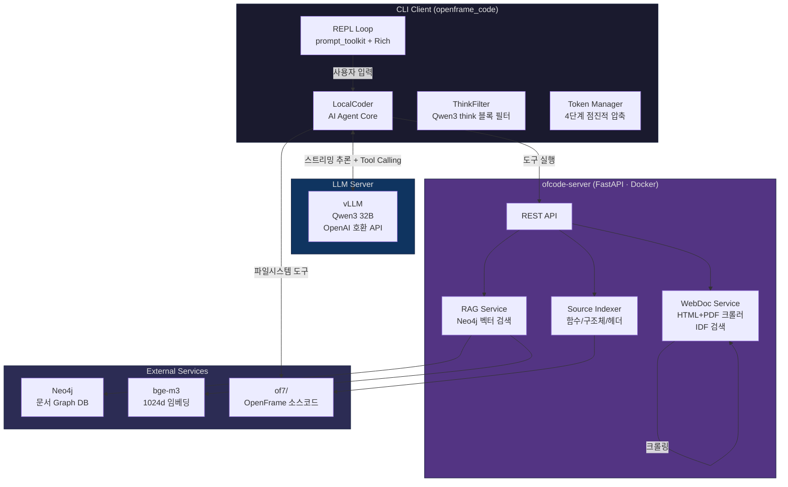
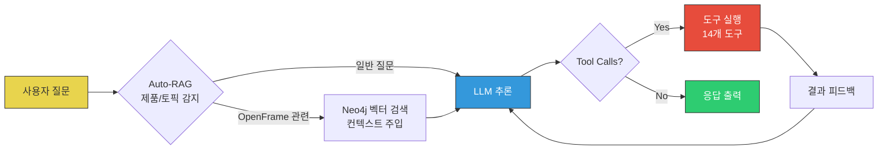
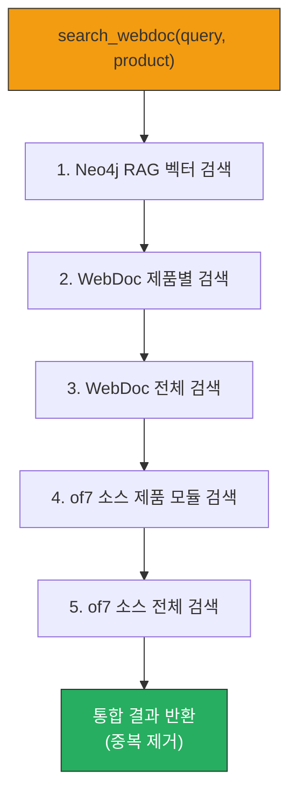
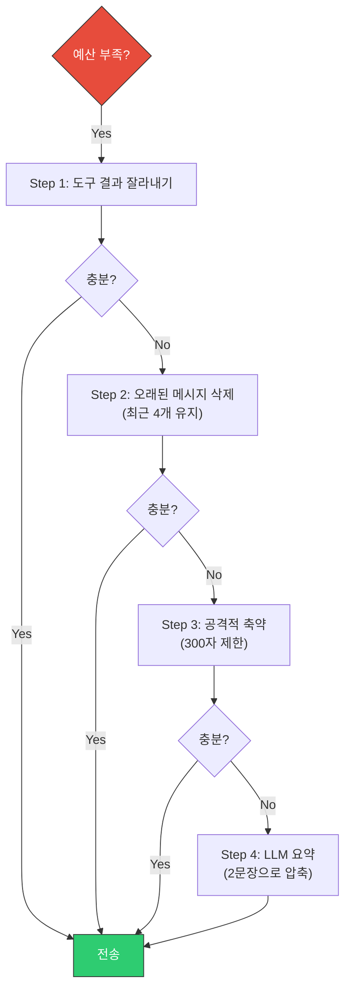

# OpenFrame Code

OpenFrame 7 Expert CLI - **AI Agent 기반** 코딩 어시스턴트.

로컬 LLM(vLLM)과 14개 도구를 활용하는 ReAct 패턴의 자율 에이전트로, OpenFrame 7 코드베이스 분석 및 코딩 작업을 지원합니다. 외부 API 과금 없이 내부 GPU 서버에서 동작합니다.

## Architecture Overview


```mermaid
graph TB
    subgraph Client ["CLI Client (openframe_code)"]
        REPL["REPL Loop<br/>prompt_toolkit + Rich"]
        LC["LocalCoder<br/>AI Agent Core"]
        TF["ThinkFilter<br/>Qwen3 think 블록 필터"]
        TC["Token Manager<br/>4단계 점진적 압축"]
    end

    subgraph LLM ["LLM Server"]
        VLLM["vLLM<br/>Qwen3 32B<br/>OpenAI 호환 API"]
    end

    subgraph Server ["ofcode-server (FastAPI · Docker)"]
        API["REST API"]
        IDX["Source Indexer<br/>함수/구조체/헤더"]
        WDS["WebDoc Service<br/>HTML+PDF 크롤러<br/>IDF 검색"]
        RAG["RAG Service<br/>Neo4j 벡터 검색"]
    end

    subgraph External ["External Services"]
        NEO["Neo4j<br/>문서 Graph DB"]
        BGE["bge-m3<br/>1024d 임베딩"]
        OF7["of7/<br/>OpenFrame 소스코드"]
    end

    REPL -->|사용자 입력| LC
    LC <-->|스트리밍 추론 + Tool Calling| VLLM
    LC -->|도구 실행| API
    LC -->|파일시스템 도구| OF7
    API --> IDX
    API --> WDS
    API --> RAG
    RAG --> NEO
    RAG --> BGE
    WDS -->|크롤링| WDS
    IDX --> OF7

    style Client fill:#1a1a2e,stroke:#16213e,color:#e0e0e0
    style LLM fill:#0f3460,stroke:#16213e,color:#e0e0e0
    style Server fill:#533483,stroke:#16213e,color:#e0e0e0
    style External fill:#2c2c54,stroke:#16213e,color:#e0e0e0
```

## AI Agent Loop

LLM이 스스로 도구 호출을 결정하고, 결과를 기반으로 다음 행동을 판단하는 **ReAct(Reasoning + Acting) 패턴**을 구현합니다.


```mermaid
flowchart LR
    A["사용자 질문"] --> B{"Auto-RAG<br/>제품/토픽 감지"}
    B -->|OpenFrame 관련| C["Neo4j 벡터 검색<br/>컨텍스트 주입"]
    B -->|일반 질문| D["LLM 추론"]
    C --> D

    D --> E{"Tool Calls?"}
    E -->|Yes| F["도구 실행<br/>14개 도구"]
    F --> G["결과 피드백"]
    G --> D

    E -->|No| H["응답 출력"]

    style A fill:#e8d44d,stroke:#333,color:#333
    style D fill:#3498db,stroke:#333,color:#fff
    style F fill:#e74c3c,stroke:#333,color:#fff
    style H fill:#2ecc71,stroke:#333,color:#fff
```

- 최대 **25회 반복** 자율 실행
- LLM이 종료 시점을 스스로 판단 (tool_calls가 없으면 종료)
- 파괴적 작업(파일 수정, 셸 명령)은 사용자 확인 후 실행

## Tool System

### 기본 도구 (7개) - 모든 모드

| 도구 | 설명 |
|------|------|
| `read_file` | 파일 읽기 (줄 번호 포함) |
| `write_file` | 파일 생성/덮어쓰기 |
| `edit_file` | 파일 내 문자열 치환 |
| `bash` | 셸 명령 실행 |
| `grep_search` | 정규식 파일 내용 검색 |
| `glob_search` | 파일명 패턴 검색 |
| `list_directory` | 디렉토리 목록 |

### OpenFrame 도구 (+7개) - `--openframe` 모드

| 도구 | 설명 |
|------|------|
| `search_of7` | of7 C/H 소스코드 정규식 검색 |
| `get_module_info` | 모듈 구조 및 설명 |
| `get_function_def` | 함수 정의 + 소스 컨텍스트 |
| `get_header_api` | 헤더 API 요약 (함수/구조체/define) |
| `get_architecture` | 6계층 아키텍처 다이어그램 |
| `find_callers` | 함수 호출자 검색 |
| `search_webdoc` | 제품 문서 통합 검색 (5단계) |

### search_webdoc 5단계 검색


```mermaid
flowchart TD
    Q["search_webdoc(query, product)"] --> S0
    S0["1. Neo4j RAG 벡터 검색"] --> S1
    S1["2. WebDoc 제품별 검색"] --> S2
    S2["3. WebDoc 전체 검색"] --> S3
    S3["4. of7 소스 제품 모듈 검색"] --> S4
    S4["5. of7 소스 전체 검색"] --> R
    R["통합 결과 반환<br/>(중복 제거)"]

    style Q fill:#f39c12,stroke:#333,color:#333
    style R fill:#27ae60,stroke:#333,color:#fff
```

## Token Overflow Prevention

컨텍스트 윈도우 초과를 방지하는 4단계 점진적 압축:


```mermaid
flowchart TD
    CHECK{"예산 부족?"}
    CHECK -->|Yes| S1["Step 1: 도구 결과 잘라내기"]
    S1 --> C1{"충분?"}
    C1 -->|No| S2["Step 2: 오래된 메시지 삭제<br/>(최근 4개 유지)"]
    S2 --> C2{"충분?"}
    C2 -->|No| S3["Step 3: 공격적 축약<br/>(300자 제한)"]
    S3 --> C3{"충분?"}
    C3 -->|No| S4["Step 4: LLM 요약<br/>(2문장으로 압축)"]
    C1 -->|Yes| OK["전송"]
    C2 -->|Yes| OK
    C3 -->|Yes| OK
    S4 --> OK

    style CHECK fill:#e74c3c,stroke:#333,color:#fff
    style OK fill:#2ecc71,stroke:#333,color:#fff
```

- 토큰 추정: `chars / 2.0` + vLLM 실제 사용량 기반 보정계수(EMA)
- vLLM 400 에러 발생 시 자동 학습 → 재시도

## Project Structure

```
local-coder/
├── local_coder.py              # 호환성 래퍼 → openframe_code.core.main
├── pyproject.toml              # 패키지 설정 (ofcode, ofcode-build-index)
├── of7_index.json              # OpenFrame 소스 인덱스 (4MB)
│
├── openframe_code/             # 메인 패키지
│   ├── core.py                 # ★ AI Agent 핵심 (LocalCoder 클래스, 1,793줄)
│   ├── cli.py                  # ofcode 엔트리포인트
│   ├── cli_indexer.py          # ofcode-build-index 엔트리포인트
│   └── indexer.py              # C/H 소스 인덱서
│
├── server/                     # FastAPI 서버 (Docker)
│   ├── ofcode_server.py        # REST API (검색, 함수조회, WebDoc, RAG)
│   ├── rag_service.py          # Neo4j + bge-m3 벡터 검색
│   ├── web_doc_service.py      # 웹문서 크롤러 + IDF 검색
│   └── Dockerfile
│
└── docs/                       # 설계/분석 문서
```

## Prerequisites

- **vLLM** with Qwen3 32B (or compatible model):
  ```bash
  vllm serve /path/to/model --enable-auto-tool-choice --tool-call-parser hermes
  ```
- **ofcode-server** (Docker) - OpenFrame 모드용
- **Neo4j** + **bge-m3** - RAG 검색용 (선택)
- **OpenFrame 7 소스코드** - `--openframe` 모드용

## Install

```bash
pip install openframe-code
```

## Quick Start

```bash
# 1. of7 소스 인덱스 빌드 (최초 1회)
ofcode-build-index --of7-root /path/to/of7

# 2. OpenFrame 전문가 모드
ofcode --openframe

# 3. 일반 코딩 어시스턴트 모드
ofcode
```

## CLI Options

```
ofcode [OPTIONS]

Options:
  --server URL          vLLM 서버 URL (default: http://192.168.8.11:12810/v1)
  --model NAME          모델명 (미지정시 자동 감지)
  --openframe           OpenFrame 전문가 모드 활성화
  --ofcode-server URL   ofcode-server URL (default: http://192.168.8.11:12820)
  --no-confirm          파괴적 작업 확인 건너뛰기
  --show-thinking       Qwen3 <think> 블록 표시
  --temperature FLOAT   샘플링 온도 (default: 0.7)
  --max-tokens INT      최대 응답 토큰 (default: 4096)
  --context-length INT  컨텍스트 윈도우 오버라이드 (자동 감지)
```

## Commands

| 명령 | 설명 |
|------|------|
| `/help` | 도움말 |
| `/exit` | 종료 |
| `/clear` | 대화 초기화 |
| `/tokens` | 토큰 사용량 + 컨텍스트 프로그레스바 |
| `/model` | 모델 정보 |
| `/compact` | 히스토리 압축 (최근 10개 유지) |
| `/reindex` | 서버 인덱스 재빌드 |
| `/crawl-webdoc [product]` | 웹문서 크롤링 |

## License

MIT
