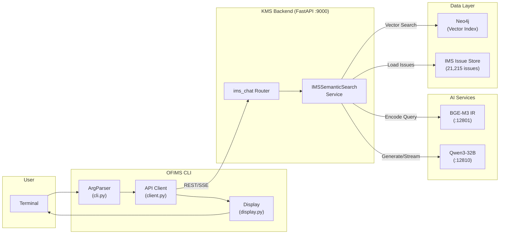
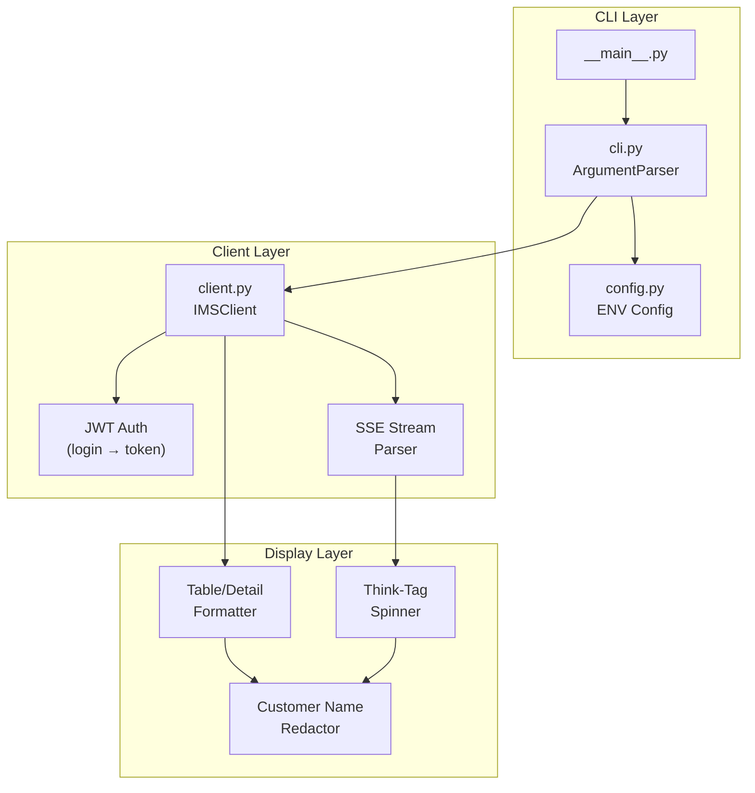
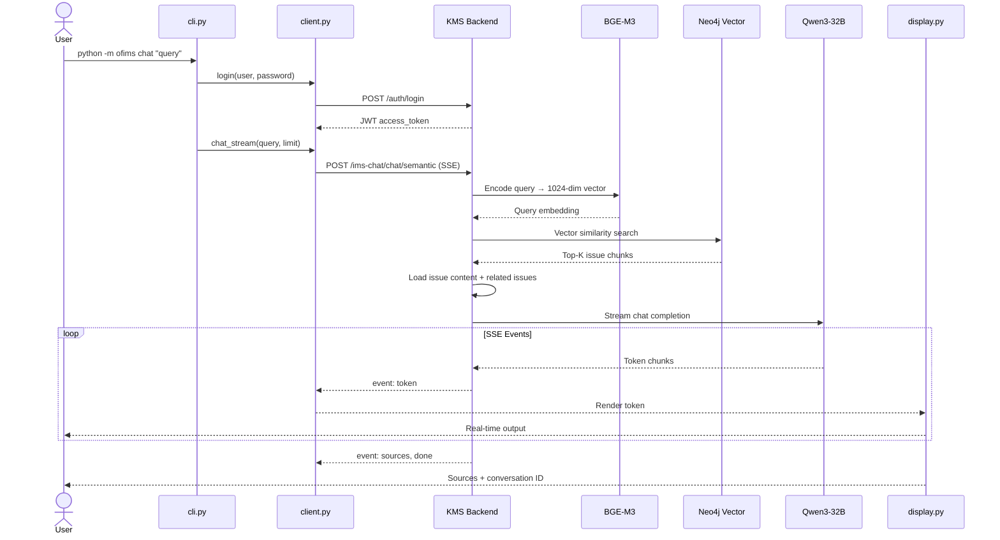

# OFIMS - IMS Semantic Search CLI

A command-line interface for semantic search across 21,215+ TmaxSoft IMS (Issue Management System) issues. Powered by BGE-M3 dense vector retrieval and Qwen3-32B LLM for intelligent issue analysis, summarization, and knowledge generation.

## Key Features

- **Semantic Search** - Natural language queries converted to BGE-M3 1024-dim vectors for cosine similarity matching against 21,215 IMS issues
- **Issue Detail** - Full issue metadata, description, action logs, and cross-referenced issues
- **Related Issue Graph** - BFS traversal of IMS#XXXXXX reference patterns with configurable depth (1-3)
- **LLM Summarization** - Structured issue summaries with key points and resolution via Qwen3-32B
- **RAG Chat** - Search + context loading + real-time LLM streaming with SSE (Server-Sent Events)
- **Knowledge Generation** - Multi-issue analysis into reusable Markdown knowledge articles
- **Privacy Protection** - Automatic customer/project name redaction in all output
- **Thinking Indicator** - Animated spinner during LLM reasoning (`<think>` tags hidden)
- **Multilingual** - Auto-detect or specify language (Korean, Japanese, English)

## Project Structure

```
ofims/
├── __init__.py      # Package declaration
├── __main__.py      # Entry point (python -m ofims)
├── cli.py           # Argument parser and command dispatcher
├── client.py        # HTTP client for KMS backend API
├── config.py        # Environment-based configuration
├── display.py       # Terminal formatting, redaction, and SSE renderer
└── README.md        # This document
```

| Module       | Responsibility                                                  |
|--------------|-----------------------------------------------------------------|
| `cli.py`     | argparse definitions, login flow, command dispatch              |
| `client.py`  | REST/SSE API calls via `requests.Session` with JWT auth         |
| `config.py`  | API URL, credentials from environment variables                 |
| `display.py` | Table/detail formatting, customer name masking, think-tag spinner |

## System Architecture



## Component Architecture



## System Execution Flow



## Technology Stack

| Layer        | Technology                          |
|--------------|-------------------------------------|
| Language     | Python 3.10+                        |
| Interface    | CLI (argparse)                      |
| HTTP Client  | requests (sync, SSE streaming)      |
| Backend API  | FastAPI + Uvicorn                   |
| Embeddings   | BGE-M3 (1024-dim dense vectors)     |
| LLM          | Qwen3-32B via vLLM                  |
| Vector Store | Neo4j (chunk_embedding index)       |
| Auth         | JWT Bearer Token                    |
| Streaming    | Server-Sent Events (SSE)            |

## Installation

```bash
# Clone the repository
git clone <repository-url>
cd kms-docker-remote

# Install dependencies
pip install requests

# Verify
python -m ofims --help
```

## Usage

### Semantic Search

Search IMS issues using natural language queries.

```bash
python -m ofims search "TJES batch job execution error"
python -m ofims search "VSAM dataset error" --limit 20
python -m ofims search "error" --product "OpenFrame Batch"
```

**Output:**
```
  Search: "TJES batch job execution error"
  Results: 10 issues (450ms)

  IMS ID     Score  Product                   Status       Subject
  ────────── ────── ───────────────────────── ──────────── ────────────────────────
  341013     0.8762 OpenFrame TJES            Closed       TJES batch job ABEND...
  ...
```

### Issue Detail

Retrieve full issue metadata, description, action logs, and references.

```bash
python -m ofims detail 110005
python -m ofims detail 347574
```

### Related Issues

Traverse IMS# cross-references to discover related issues.

```bash
python -m ofims related 347574
```

### Issue Summarization

Generate structured summaries using LLM analysis.

```bash
python -m ofims summarize 110005
python -m ofims summarize 110005 --lang ko
python -m ofims summarize 110005 --lang ja
```

### RAG Chat

Full pipeline: search + context + LLM streaming response.

```bash
python -m ofims chat "What causes batch job execution errors?"
python -m ofims chat "tjesmgr BOOT failure resolution" --limit 10
python -m ofims chat "VSAM related issues" --no-related --lang ko
```

**Output:**
```
  Searching: "tacfmgr error" (limit=10)
  Found 10 issues (464ms)
    IMS#214995 (0.8529) ...
    IMS#83734  (0.8487) TACFMGR -18011 error
  Context: 7 issues + 5 related

  ────────────────────────────────────────────────────────────
  ⠹ thinking... (12s)

  [LLM-generated analysis with IMS# citations]

  ────────────────────────────────────────────────────────────
  Sources:
    IMS#214995 (0.8529) ...
    IMS#83734  (0.8487) TACFMGR -18011 error

  [conversation: 921f22e0...]
```

### Knowledge Generation

Synthesize multiple issues into a reusable knowledge article.

```bash
python -m ofims create-knowledge 110005 60605 --title "TJES Batch Error Guide"
python -m ofims create-knowledge 347574 345945 --title "Return Code Troubleshooting" --lang ko
```

## Configuration

### Environment Variables

| Variable         | Default                  | Description           |
|------------------|--------------------------|-----------------------|
| `OFIMS_API_URL`  | `http://localhost:9000`  | KMS backend API URL   |
| `OFIMS_USERNAME` | `admin`                  | Login username         |
| `OFIMS_PASSWORD` | *(see config)*           | Login password         |

### CLI Global Options

All subcommands accept these options:

```bash
python -m ofims --url http://192.168.8.11:9000 search "error"
python -m ofims --user admin --password "password" detail 110005
```

## API Endpoint Mapping

| CLI Command        | HTTP Method | API Endpoint                           |
|--------------------|-------------|----------------------------------------|
| `search`           | POST        | `/api/v1/ims-chat/search`              |
| `detail`           | GET         | `/api/v1/ims-chat/issues/{ims_id}`     |
| `related`          | GET         | `/api/v1/ims-chat/issues/{ims_id}/related` |
| `summarize`        | POST        | `/api/v1/ims-chat/issues/summarize`    |
| `chat`             | POST (SSE)  | `/api/v1/ims-chat/chat/semantic`       |
| `create-knowledge` | POST        | `/api/v1/ims-chat/knowledge/create`    |

## Extending the Project

### Adding a New Command

1. Define the subparser in `cli.py`:
   ```python
   p_new = sub.add_parser("new-cmd", help="Description")
   p_new.add_argument("arg", help="Argument")
   ```

2. Add the API method in `client.py`:
   ```python
   def new_method(self, arg: str) -> dict:
       resp = self.session.post(f"{self.api_url}/new-endpoint", json={"arg": arg})
       resp.raise_for_status()
       return resp.json()
   ```

3. Add the display function in `display.py`:
   ```python
   def print_new_result(data: dict) -> None:
       print(f"  Result: {data.get('field', '')}")
   ```

4. Wire it in the dispatch block in `cli.py`:
   ```python
   elif args.command == "new-cmd":
       result = client.new_method(args.arg)
       display.print_new_result(result)
   ```

### Adding Customer Name Filters

Add entries to `_CUSTOMER_NAMES` in `display.py` (and in the backend service `ims_semantic_search_service.py` for server-side redaction).

## Development Guidelines

- **Configuration**: All settings via environment variables (`config.py`), no hardcoded values
- **Separation**: CLI parsing (`cli.py`) → API calls (`client.py`) → Output formatting (`display.py`)
- **Privacy**: All user-facing output passes through `_strip_customer_info()` for customer name redaction
- **Streaming**: SSE events parsed incrementally; `<think>` tags replaced with animated spinner
- **Error Handling**: Login failures and API errors reported to stderr with non-zero exit code
- **Encoding**: Use `PYTHONIOENCODING=utf-8` on Windows for CJK character support
